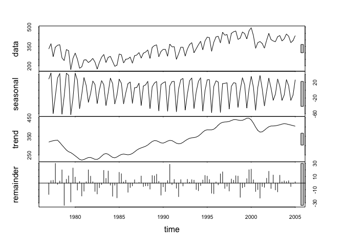
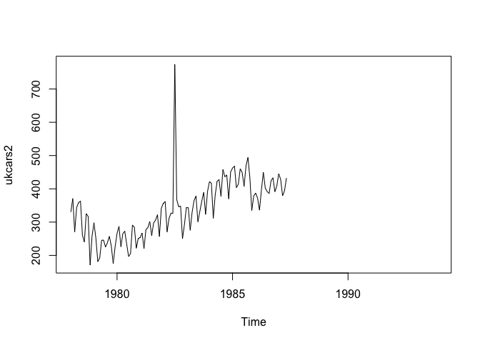

# Week9HW_GARZA
Tony Garza  
July 20, 2016  
# Part1: ukcars

```r
library(fpp) #fpp package must be installed first
```

```
## Loading required package: forecast
```

```
## Loading required package: zoo
```

```
## 
## Attaching package: 'zoo'
```

```
## The following objects are masked from 'package:base':
## 
##     as.Date, as.Date.numeric
```

```
## Loading required package: timeDate
```

```
## This is forecast 7.1
```

```
## Loading required package: fma
```

```
## Loading required package: tseries
```

```
## Loading required package: expsmooth
```

```
## Loading required package: lmtest
```

```r
data(ukcars)
plot(ukcars)
```

<!-- -->

```r
fitd <- decompose(ukcars)
plot(fitd)
```

<!-- -->

```r
fit <- stl(ukcars, s.window=5)
plot(fit)
```

<!-- -->

```r
eeadj <- seasadj(fitd)
plot(eeadj)
```

<!-- -->

```r
ukcars2 <- ts(c(ukcars[1:54],ukcars[55]+500,ukcars[56:191]),start=c(1978,1),frequency=12)
plot(ukcars2)
```

<!-- -->

```r
#plot(elecequip, col="gray",
#  main="Electrical equipment manufacturing",
#  ylab="New orders index", xlab="")
#lines(fit$time.series[,2],col="red",ylab="Trend")
```

# Part2: Volatility Study for GW Pharmaceuticals PLC- ADR Stock (GWPH)
## Download Data and Calculate Volatility

```r
library(tseries)

stockdata <- get.hist.quote('gwph',quote="Close") #downloads the stock data
```

```
## time series starts 2013-05-01
```

```r
length(stockdata)
```

```
## [1] 814
```

```r
stockret <- log(lag(stockdata)) - log(stockdata) #create the log returns of the GWPH data set

stockvol <- sd(stockret) * sqrt(250) * 100 #formula for volatilty
stockvol #returns the volatility
```

```
## [1] 76.127
```

### This stock has a volatility of 76%

## Create Volatility Function (Continuous Lookback Window)

```r
## create volatility function
get
```

```
## function (x, pos = -1L, envir = as.environment(pos), mode = "any", 
##     inherits = TRUE) 
## .Internal(get(x, envir, mode, inherits))
## <bytecode: 0x7fe9219df3f8>
## <environment: namespace:base>
```

```r
Vol <- function(d, logrets)
{
  
  var = 0
  
  lam = 0
  
  varlist <- c()
  
  for (r in logrets) {
    
    lam = lam*(1 - 1/d) + 1
    
    var = (1 - 1/lam)*var + (1/lam)*r^2
    
    varlist <- c(varlist, var)
    
  }
  
  sqrt(varlist)
}
```
## Plot the results with varying weights

```r
volest <- Vol(10,stockret) # use function to provide volatility for different values of d (10)

volest2 <- Vol(30,stockret) # use function to provide volatility for different values of d (30)

volest3 <- Vol(100,stockret) # use function to provide volatility for different values of d (100)

plot(volest,type="l", main="Volatility of GWPH Stock", sub="Continuous Lookback Window") # plot the results

lines(volest2,type="l",col="red") # overlay d=30 plot

lines(volest3, type = "l", col="blue") # overlay d=100 plot

legend(0,.25,c("d=10","d=30","d=100"),lty=c(1,1),lwd=c(2.5,2.5),col=c("black","red","blue")) # add legend
```

<!-- -->

### This stock started somewhat volatile, stabalized, and then went extremely volatile toward the end of the data stream
